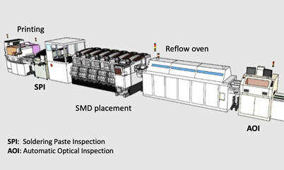

Data Challenge
==============

### _Sponsored by:_

Introduction
------------

In this edition of the annual PHME Data Challenge, participants are challenged to demonstrate the application of state-of-the-art algorithms and models to solve a classification problem for a real production line. This year’s Challenge is held in collaboration with Bitron Spa, a leading company in the development and manufacturing of mechatronic devices. Thanks to this collaboration, the competition has exclusive access to an extensive dataset of a real industrial production line equipped with automated, integrated and fully connected machines (Industry 4.0), as shown in Figure 1. These connected machines constitute a complete production line that starting from a Printed Circuit Board (PCB), builds Electric Circuit Board.

In detail, during the production line, the PCB goes through the following steps:

**1\. The printing machine**: initially, by using a laser prints a serial number on the PCB and then places the solder paste.  
**2\. Solder paste inspection (SPI)**: checks the solder paste placed by the printing machine placed to identify possible problems, e.g. too much/missing paste, short circuit, etc. It stores rich metadata.  
**3\. Surface mount device (SMD) placement**: places the electronic components on the PCB.  
**4\. Reflow oven**: reflows the solder paste in a molten state to create permanent solder joints.  
**5\. Automatic Optical Inspection (AOI)**: automatically inspects the PCB to detect defects in the previous steps, e.g., missing components, fillet size or shape of fillets, or misalignment of components, etc.

Figure 1: PCB Production line.

During the challenge, the teams gain access to the data from the Solder Paste Inspection (SPI) and the Automated Optical Inspection (AOI) machines. The datasets provided by these machines will be used for the prediction of the quality damages of the final products. The data were collected during the real manufacturing of PCBs under normal conditions.

In this scenario, the SPI data, reports, for each PCB, characteristics such as

_• Identifie_rs: PanelID, FigureID, ComponentID, PinNumber  
_• Soldering paste characteristics_: Volume, Area, Height, Shape, Results

While the AOI data describe, for PCB each defect highlighted by the machine, characteristics such as:

• Identifier: PanelID, FigureID, ComponentID  
• Defect labels: label according to the AOI machine, a label applied by the operator after visual inspection, a label applied by a second operator based on the possibility of repair.

The goal is to design an algorithm to predict the defect labels for the components. Specifically, the goal is to develop a hierarchical classification predicting: (i) whether the AOI classifies **the component** as defective; (ii) in the case of a defect, the label applied by the operator; (iii) in the case of confirmation of the defect by the operator, the repair label.

The ultimate goal of this classification system is to improve the efficiency of the PCB manufacturing process, facilitate the operator’s work and minimize the cases of manual intervention. A performing classification model can help the operator identify the components to be reworked after the SPI step, reducing the number of images she has to process.

The dataset used for training and validation of the model will be made available immediately after the start of the competition. The use of data-driven and physics-based modelling approaches is encouraged. To standardize the final performance evaluation, a standard Python script will be provided during the competition period. The teams are also encouraged to use the online **Data Science environment** **offered by Politecnico di Torino** to work on their solution. This also allows the teams to be **part of the leader board** and evaluate their progress day by day.

Winning teams will be asked to write a full manuscript that will be published in the PHM conference proceedings, and a representative will be expected to give an oral presentation at the event. The award will be presented at the conference social event.

For any questions about the competition, please [**contact us**](mailto:datachallenge@phmeurope.org).

Teams
-----

Collaboration is encouraged and teams may comprise students and professionals from single or multiple organizations. There is no requirement on team size. Register your team’s entry by filling the [**form here**](https://phm-europe.org/dc-registration).

The winning teams will be selected and awarded contingent upon:

• Having at least one member of the team register and attend the PHM 2022 Conference.  
• Submitting a peer-reviewed conference paper.  
• Presenting the analysis results and technique employed at the conference.

The organizers of the competition reserve the right to modify these rules and disqualify any team for any efforts it deems inconsistent with fair and open practices.

Computing Environment
---------------------

The participants will have the opportunity to use the **online environment for Data Science hosted by Politecnico di Torino**, hosted at jupyter.polito.it. It offers the possibility of running interactive **Jupyter Notebooks** via the browser, exploiting the storage and computational power of a large data centre. Users can develop, execute and test their code online and access **persistent storage** using the popular Jupyter Lab interface.

Participants in the data challenge are **strongly encouraged** to use the online environment. The participants’ code will be executed on daily basis by the environment to offer an online **leader board**, indicating the scores of the teams.

To have an account or request help, please [**email us**](mailto:datachallenge@phmeurope.org).

GitHub Repository
-----------------

For Questions and Answers, Teams are encouraged to leverage the PHME Data Challenge [**GitHub repository**](https://github.com/PHME-Datachallenge) to open issues and discuss them. The repository will be used also to publish updates such as the evaluation metrics, evaluation process, the  Jupyter script used for the evaluation and update the leader board.

Prize
-----

The winning team will be awarded a GPU graphics card courtesy of our sponsor NVIDIA. Additionally, each of the top three teams will be offered one free registration per team for the conference.

Relevant Dates
--------------

Competition Open:

March 15, 2022

Competition Closed:

June 8, 2022, 11:59:59 GMT

Winners Announced:

June 11, 2022

Final Papers Due, Winners Announced:

June 19, 2022

PHM Conference Dates:

July 6 2022

**System Description**
----------------------

The production line under consideration represents a typical automated industrial pipeline and can therefore be easily generalized to other Industry 4.0 production lines.

As shown schematically in Figure 1, the production line is responsible for manufacturing printed circuit boards (PCBs). The production line starts the printing machine, which receives the **_panels_** consisting of multiple **_figures_**. Each _figure_, is a PCB. All PCBs have the same characteristics, with the same components to be placed. Figure 2 shows an example of a _panel_ with 4 _figures_.

Figure 2: Panel gave in the input of the production line containing 4 figures (a figure is a PCB).

Each figure is a single PCB with its electric schema, electronic connections, and component placement indication. Each component is identified by a ComponentID and must be placed in the PCB location identified by the ComponentID. Figure 3 shows a PCB example with the ComponentIDs and the pins used for soldering (goal dots), e.g., R30, a resistor with 2 pins, or IC1, an integrated circuit with 14 pins, etc.

Figure 3: PCB example.

Each _panel_ is identified by a unique _PanelID_ (e.g., 25319009400520102844). The PCB is identified by a unique _BoardID_, which is the combination of _PanelID_ and _FigureID_. For example, the _BoardID_ (25319009400520102844, 1) is the first figure in panel 25319009400520102844.

After the printing machine step, where the solder paste is placed, the Solder Paste Inspection (SPI) machine inspects the figures to identify problems in the solder printing phase. In detail, the data for each PCB describes all components and pins characteristics such as solder volume and area, size of solder dot, quality of solder paste placement, etc. The full list of features can be found in the dataset section.

After SPI, all panels pass through the SMD pick-and-place machine to assemble the components and the reflow oven to complete the soldering phase.

Finally, the panels enter the Automatic Optical Inspection (AOI) phase to automatically inspect the panels and detect defects resulting from the previous steps. If a panel has a defect, the AOI data display **all and only** the defect information. For each defect, the AOI generates an entry indicating the PanelID and the FigureID of the PCB, the affected component, eventually the pin having the problem, and the type of defect identified. The entry also reports the result of the operator’s visual inspection. If the operator confirms the defect, a second operator evaluates the repair option; the entry also contains the result of this step.

**Datasets and Challenge**
--------------------------

### Dataset Description

The dataset is available via the PHME Data Challenge [**GitHub repository**](https://github.com/PHME-Datachallenge). It is composed of **data collected by the SPI and AOI** instruments.

The SPI dataset contains different characteristics for each panel, figure, component, and pin.

In detail, SPI generates a csv file with the following characteristics:

*   **PanelID**: the _panel_
*   **FigureID**: the _figure_ The combination of _PanelID_ and _FigureID_ is the _BoardID_ and identifies the PCB.
*   **ComponentID**: the _component_ identifier
*   **PinNumber**: the number of the pin considered for the component
*   **PadID**: the unique identified of the **Pad** that supports the pins
*   **Date**: the date when the SPI operation was performed
*   **Time**: the time ins seconds when the SPI operation was performed
*   **PosX(mm)**: the X coordinate of the pin considering starting from the bottom left cornet
*   **PosY(mm)**: the Y coordinate of the pin considering starting from the bottom left cornet
*   **PadType**: the type of Pad
*   Features regarding welding paste characteristics:
    *   **Volume(%)**, **Height(um)**, **Area(%)**, **OffsetX(%)**, **OffsetY(%)**, **SizeX**, **SizeY**, **Volume(um3)**, **Area(um2)**, **Shape(um)**
*   **Result**: the result of the SPI inspection

Instead, the AOI machine, produces only records for defects detected by the AOI. In detail, the AOI produces a csv file describing the following characteristics:

*   **PanelID**: the _panel_ identifier
*   **FigureID**: the _figure_ The combination of _PanelID_ and _FigureID_ is the _BoardID_ and identifies the PCB.
*   **ComponentID**: the _component_ identifier
*   **PinNumber**: the number of the pin considered for the component – **if available**
    *   **In case is not available** value equal to NA is reported.
*   **MachineID**: the identifier of the machine performing the AOI operation
*   **_AOILabel_**: the label applied by the AOI machine, i.e., the type of defect.
*   **_OperatorLabel_:** the label applied by the human operator after visual inspection
    *   **Good**: the AOI raised a false defect
    *   **Bad**: the operator confirms the AOI message
*   **_RepairLabel_:** the label applied by the repairment operator after an inspection with a microscope
    *   **NA**: Not Available as the AOI raised a false defect (Good according to the OperatorLabel).
    *   **NotYetClassified**: no information about the repair is available.
    *   **NotPossibleToRepair**: impossible to repair. The Panel is discarded.
    *   **FalseScrap**: the operator raised a false defect as the component does not need any repair operation.

**The AOI dataset reports an entry only when a defect is detected.** Therefore, all SPI entries that have no equivalent in the AOI dataset can be classified as Good (i.e., without defect). If a component has a defect, it is present in the AOI dataset, and the **AOILabel** indicates the type of defect detected by the AOI engine. In total, **11 possible labels** are assigned by the AOI machine. Subsequently, all defects are visually inspected by a human operator. The operator applies the **OperatorLabel** with 2 possible labels to confirm the presence of a possible defect or to identify a false defect. Finally, for the components inspected by the repair operator (a human, specialized in repair), there is the **RepairLabel** taking **3 possible labels**, 2 for the repair process and 1 to identify components for which no information is available.

### Challenge

The objectives of this data challenge are to develop models able to hierarchically predict the labels **at component level, i.e., at PanelID, FigureID and ComponentID level****.** In detail, the models have to:

1.  _Predict AOI defects_: to tackle a predictive scenario, teams must develop models that predict whether the AOI will identify defects in **PCB components** given the SPI data. In other words, it must predict whether an entry for **that component** will be present in the AOI dataset (remind that a component is not present in the AOI dataset if it has no defect). So the prediction of **AOILabel** **is not required**.
2.  _Predict the Human Inspection_: To accelerate the identification of true defects, teams have to develop models capable of predicting human-made visual inspection labels (i.e., **OperatorLabel**). For this, teams can use all the features available in the SPI dataset as well as the output label of the AOI (i.e., the **AOILabel** feature).
3.  _Predict the Human Repair_: to avoid wasting time on PCBs that cannot be repaired or do not need to be repaired, teams must develop models capable of predicting the human-assigned repair label (**RepairLabel**). To do this, teams can use all of the features available in the SPI dataset as well as the output label of the AOI (i.e., the AOILabel feature). Specifically, the team must predict whether the PCBs is **NotPossibleToRepair**, or **FalseScrap**.

Secretary PHME22

For any request, please contact:

   +33 (0)2 47 27 33 30

   **secretary\[at\]phmeurope.org**

Key dates

Abstracts submission extended deadline: **February 14th, 2022  
**Paper and poster submissions due: **April 3rd, 2022  
**Doctoral Symposium submission deadline: **April 15th, 2022**  
Paper review feedback: **May 2nd, 2022**  
Final paper or poster due: **May 16th, 2022  
**Final camera-ready papers due: **June 20th, 2022  
**

Partners

jQuery(document).ready(function() { jQuery(".smooth\_slider\_fouc .smooth\_slider").show(); });jQuery(document).ready(function() { jQuery("#smooth\_slider\_1").smooth({ fx: "fade", speed:"500", timeout: 2000,pause: 1 ,slideExpr: "div.smooth\_slideri" }); jQuery("#smooth\_slider\_1").touchwipe({ wipeLeft: function() { jQuery("#smooth\_slider\_1").smooth("next"); }, wipeRight: function() { jQuery("#smooth\_slider\_1").smooth("prev"); }, preventDefaultEvents: false });jQuery("#smooth\_slider\_1").smoothSlider({ sliderWidth :450, sliderHeight :100, navArr :0, img\_align :"none" });});

jQuery("html").addClass("smooth\_slider\_fouc");jQuery(".smooth\_slider\_fouc .smooth\_slider").hide();

Powered by [**VERT COM agency**](https://www.agence-vert.com/)

 /\* <!\[CDATA\[ \*/ var wppopups\_vars = {"is\_admin":"","ajax\_url":"https:\\/\\/phm-europe.org\\/wp-admin\\/admin-ajax.php","pid":"945","is\_front\_page":"","is\_blog\_page":"","is\_category":"","site\_url":"https:\\/\\/phm-europe.org","is\_archive":"","is\_search":"","is\_singular":"1","is\_preview":"","facebook":"","twitter":"","val\_required":"This field is required.","val\_url":"Please enter a valid URL.","val\_email":"Please enter a valid email address.","val\_number":"Please enter a valid number.","val\_checklimit":"You have exceeded the number of allowed selections: {#}.","val\_limit\_characters":"{count} of {limit} max characters.","val\_limit\_words":"{count} of {limit} max words."}; /\* \]\]> \*/ /\* <!\[CDATA\[ \*/ var wpcf7 = {"api":{"root":"https:\\/\\/phm-europe.org\\/wp-json\\/","namespace":"contact-form-7\\/v1"}}; /\* \]\]> \*/ jQuery(function(){lightbox\_init({social\_tools: "",overlay\_gallery: false});sidebar\_slide\_init();page\_out\_init();om\_local\_scroll\_init();});
